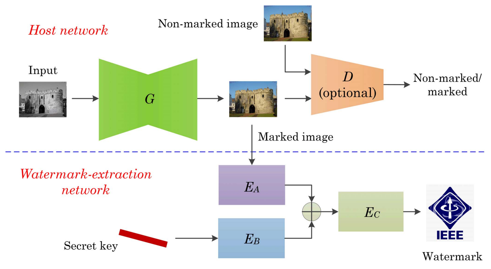
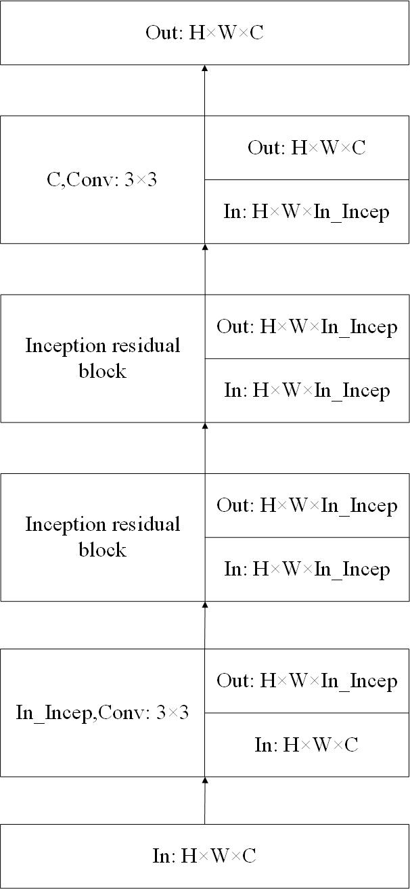
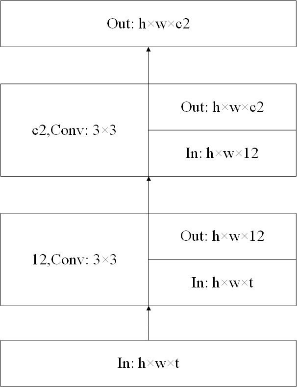
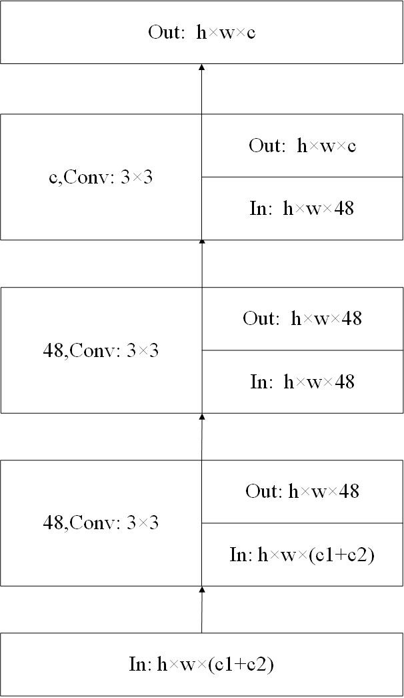

# Watermarking-deep-neural-networks-for-intellectual-property-protection-using-watermarked-images

## References

This project is an original PyTorch implementation developed based on the concepts presented in the following paper:

```bibtex id="k5x5wa"
@ARTICLE{wu2021watermarking,
  author={Wu, Hao and Liu, Guanghui and Yao, Yu and Zhang, Xiaolin},
  journal={IEEE Transactions on Circuits and Systems for Video Technology},
  title={Watermarking Neural Networks With Watermarked Images},
  year={2021},
  volume={31},
  number={7},
  pages={2591-2601},
  doi={10.1109/TCSVT.2020.3030671}
}
```

Paper:
https://ieeexplore.ieee.org/document/9222304


---
### watermarking_Framework



### Extractor Model

*Custom architecture visualization inspired by Wu et al. (2021). The implementation and channel configurations were modified for this project.*


| EA                         | EB                        | EC                        |
| -------------------------- | ------------------------- | ------------------------- |
|  |  |  |

---

### Inception Residual Block

*Custom architecture visualization inspired by Wu et al. (2021). The implementation and channel configurations were modified for this project.*


